### 误区

漏洞位置在/php/function.php

可以看到ywID()方法进行sql语句的查询，其中$ID是直接进行语句拼接的

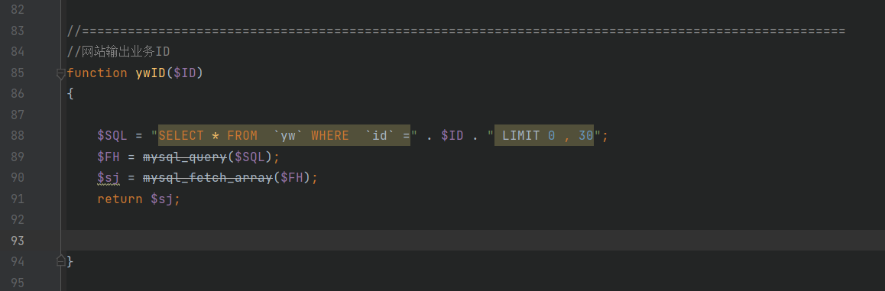

跟踪ywID()方法，该方法在/php/v144.php进行调用

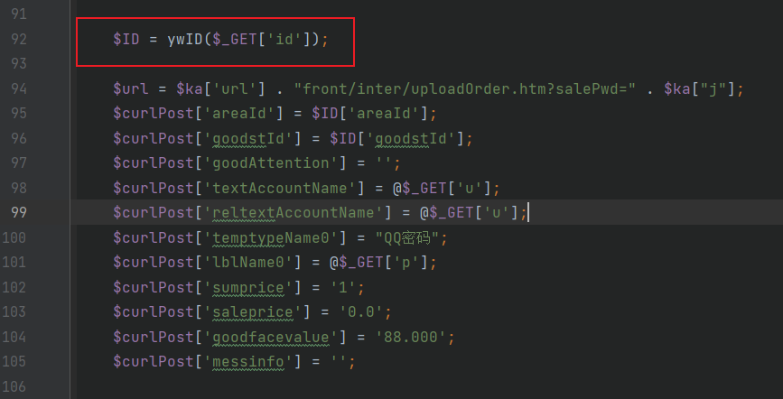

访问该地址http://127.0.0.1/sqqyw/php/v144.php

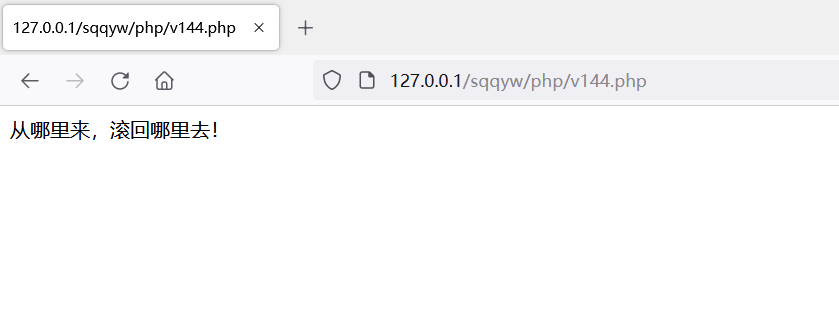

跟踪提示，位于/php/v144.php，打印这几个变量，方便我们分析程序的运行

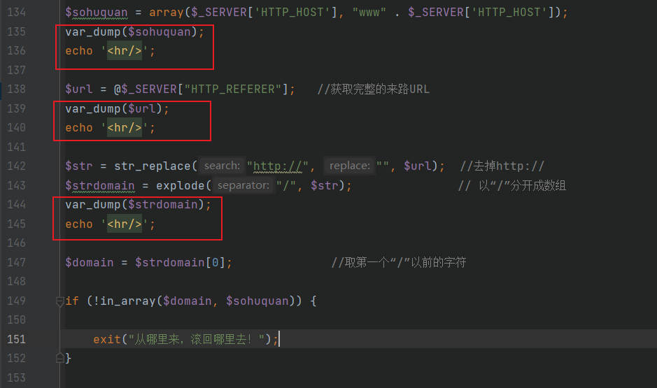

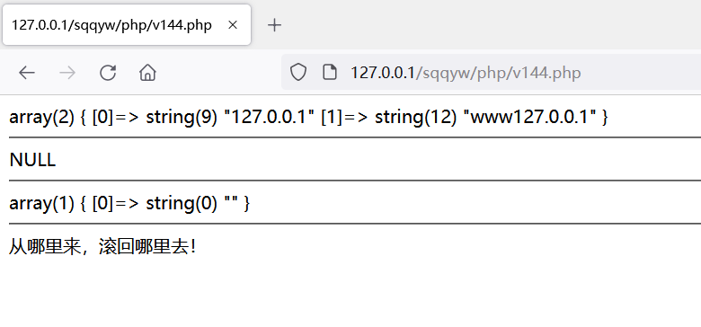

分析程序可知，在此处会判断Referer字段是否存在于$sohuquan中，那么我们思路就有了，抓取数据包，添加Referer字段为127.0.0.1

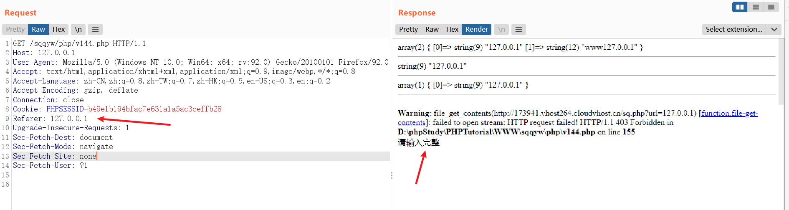

好的，程序又有提示了，继续跟，在/php/v144.php发现了两处

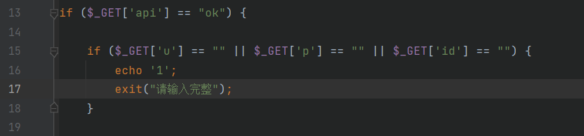

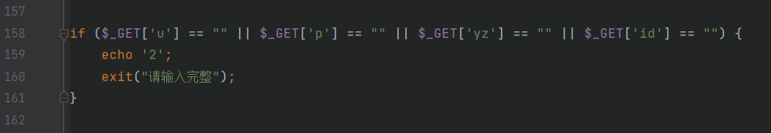

打印1和2来判断在哪里提示了

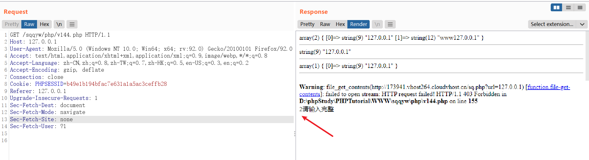

程序输出2，表名是在第二处进行提示了，分析程序，该处使用get请求接收了u、p、yz和id字段，其中一个为空的话，那么会进行提示，所以我们添加get请求的参数

提示验证码错误，但是此时，我们已经发现了id字段，返回前面我们发现id字段的传参是使用ywID()方法的，因此，sqlmap尝试一下

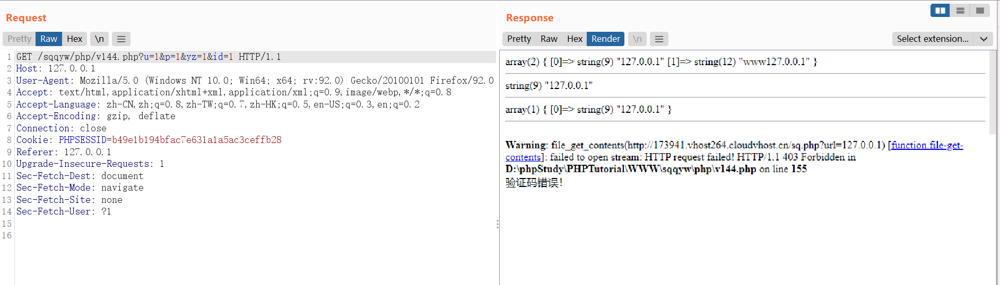

sqlmap跑不出来，设置代理抓一下sqlmap的包看看

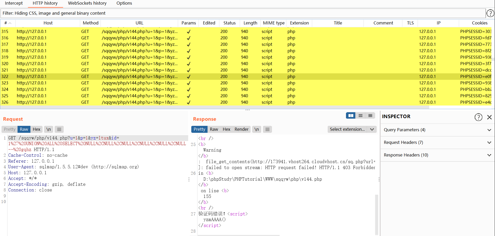

发现一直提示**验证码错误**，网上找了一些资料，发现注入点不是这个地方，而是在这个地方

sqlmap尝试注入，注入点是在这里，因此前面的分析是错误的

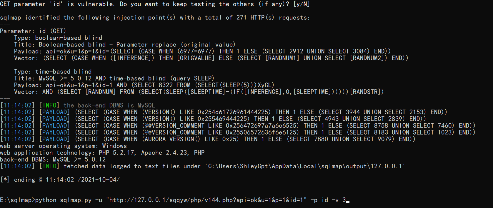

### 总结

正确的思路应该是全局搜索，找到URL传参的地方，例如$_POST、\$GET，然后进行SQL注入尝试，直接访问这个URL也是可以的，不需要验证Referer字段

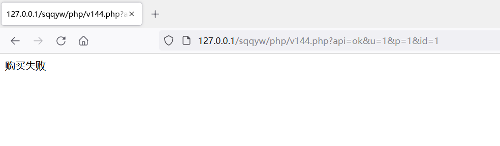

### 参考

https://blog.csdn.net/qq_50589021/article/details/120313912