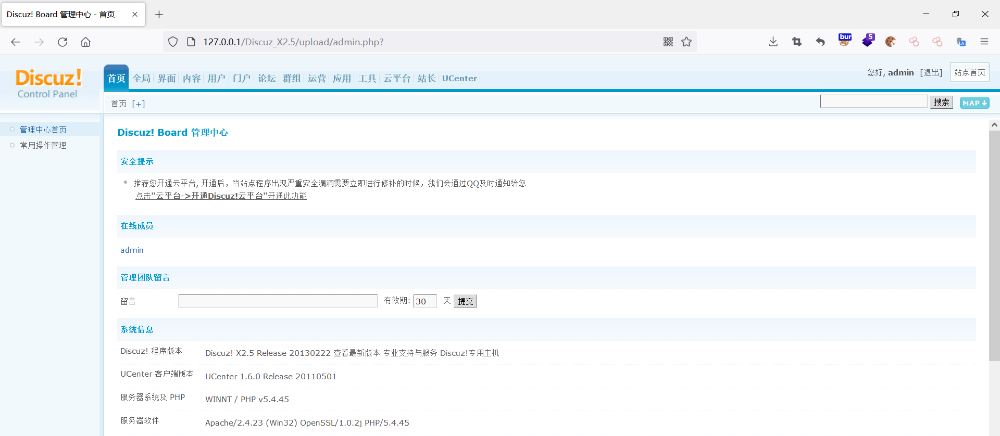
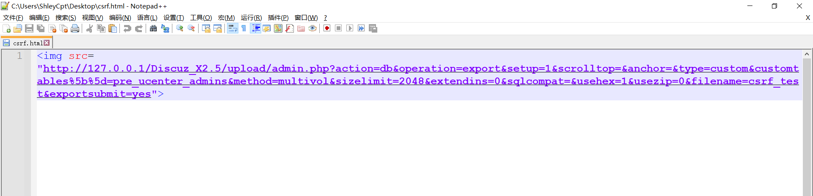

### Discuz X 备份功能

由于CSRF的危害是造成Discuz X被脱库，那么我们先来看一下Discuz X的备份功能


管理员登录后，依次点击站长-数据库-自定义备份-提交，进行数据库导出备份


随后提示备份成功，然后在对应文件夹下即可找到备份的文件


### 


查看burp抓取的数据包，有一个post请求，三个get请求，其中，post把请求交给对应的代码进行执行，get执行代码备份了三个文件


### 漏洞分析

**漏洞成因是因为备份数据时，数据包未添加token字段（确认用户身份的唯一的/不可预测的字段）来验证用户的身份，因此，攻击者可以构造恶意网页/数据包，诱使管理员打开，从而完成恶意操作**


先来看一下第一个post请求，请求的是admin.php，**注意一下action和operation键名对应的值**


看一下admin.php的代码，这里会将我们的请求发送到admincpfile()函数里来进行对应的执行，所以，跟踪admincpfile()函数

```php
if(empty($action) || $frames != null) {
	$admincp->show_admincp_main();
} elseif($action == 'logout') {
	$admincp->do_admin_logout();
	dheader("Location: ./index.php");
} elseif(in_array($action, $admincp_actions_normal) || ($admincp->isfounder && in_array($action, $admincp_actions_founder))) {
	if($admincp->allow($action, $operation, $do) || $action == 'index') {
		require $admincp->admincpfile($action);  # 看这里
	} else {
		cpheader();
		cpmsg('action_noaccess', '', 'error');
	}
} else {
	cpheader();
	cpmsg('action_noaccess', '', 'error');
}
```


好的，找到了对应关系了，admincpfile()函数会把我们的请求的$action拼接到./source/admincp/admincp_'.$action.'.php对应的文件中去，所以，**该post对应的请求就到了 ./source/admincp/admincp_db.php里面**

```php
function admincpfile($action) {
		return './source/admincp/admincp_'.$action.'.php';
	}
```


接下来对./source/admincp/admincp_db.php进行代码分析


这两个判断对备份文件的路径进行了一个定义，如果没设置backupdir参数的话，那么backupdir为一个六位数的随机指定数值，随后跟backup_进行拼接，再然后跟./data/进行拼接，即备份的路径为：./data/backup\_加上六位随机数，可以查看我们前面成功备份的文件路径data/backup_9e5a20，六位随机数即为9e5a20

```php
if (!$backupdir) {
    $backupdir = random(6);
    @mkdir('./data/backup_' . $backupdir, 0777);
    C::t('common_setting')->update('backupdir', $backupdir);
}
$backupdir = 'backup_' . $backupdir;
if (!is_dir('./data/' . $backupdir)) {
    mkdir('./data/' . $backupdir, 0777);
}
```


在往后，filename从get获取，因此filename参数可控

```php
$backupfilename = './data/' . $backupdir . '/' . str_replace(array('/', '\\', '.', "'"), '', $_GET['filename']);
```


最后输出的文件代码如下，前面分析过，$backupdir路径中有一个六位的随机数，加上filename参数是可控的，因此在爆破$dumpfile即最终输出的备份文件时，仅需要爆破$backupdir即可获得备份文件的位置

```php
$dumpfile = $backupfilename . "-%s" . '.sql';
```


利用csrf漏洞，构造payload，即可获取到数据库的备份，注意：**customtables[]（其中中括号使用了URL编码）字段为需要导出的表名，filename为导出后文件的名称**

```php

```


### 漏洞利用

本次我们导出pre_ucenter_admins表，先来看看该表中的内容


首先，我们使用管理员登录




构造payload代码




管理员打开该页面


可以看到文件夹下面出现了我们备份的文件：csrf_test.sql文件


表中的内容

