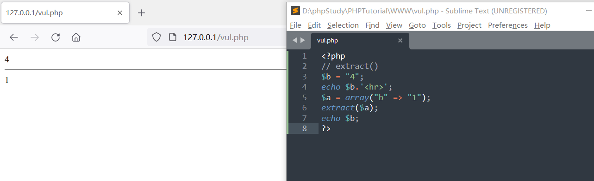
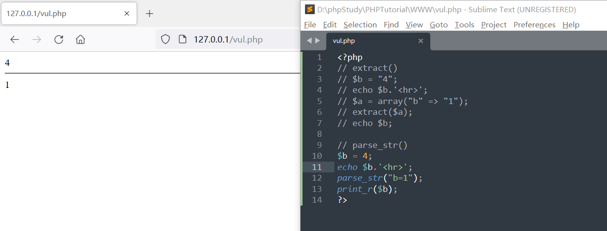
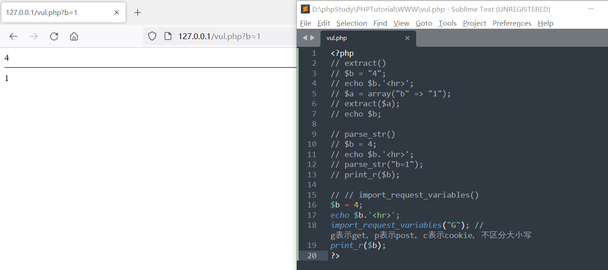
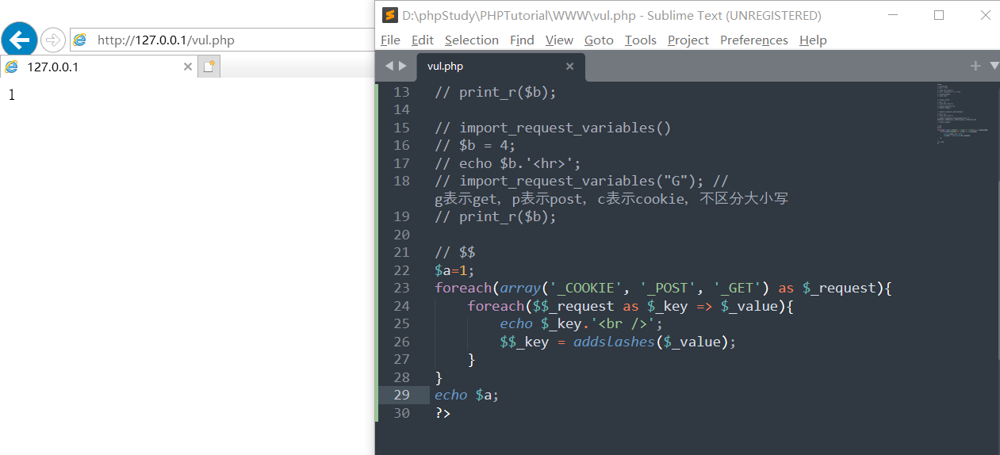
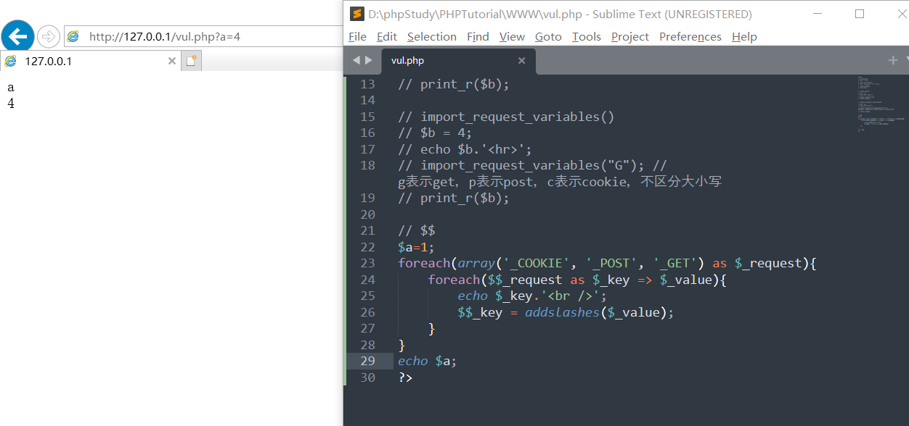

### 什么是变量覆盖漏洞

变量覆盖漏洞指的是**可以用我们自定义的参数值替换程序原有的变量值，**变量覆盖通常需要结合程序的其他功能来实现完整攻击


### 变量覆盖漏洞挖掘

#### 变量覆盖函数

经常引发变量覆盖的函数有extract()、parse_str()、import_request_varuables()


##### extract()

[菜鸟教程关于extarct()函数的介绍 ](https://www.runoob.com/php/func-array-extract.html) ，extract()函数覆盖变量需要一定的条件，它的功能官方说明是"从数组中将变量导入到当前的符号表"，通俗的将就是将数组中的键值对注册成为变量

```php
// extract()
$b = "4";
echo $b.'<hr>';
$a = array("b" => "1");
extract($a);
echo $b;
```

原本变量$b的值为4，经过extract()函数处理后，$b的值变为1




##### parse_str()

[菜鸟教程关于parse_str()函数的介绍](https://www.runoob.com/php/func-string-parse-str.html) ，parse_str()的作用是解析字符串并且注册成为变量

```php
// parse_str()
$b = 4;
echo $b.'<hr>';
parse_str("b=1");
print_r($b);
```

原本变量$b的值为4，经过parse_str()函数处理后，$b的值变为1




##### import_request_variables()

[菜鸟教程关于import_request_variables()函数的介绍](https://www.runoob.com/php/php-import_request_variables-function.html)  ，import_request_variables() 函数将 GET、POST、Cookie 变量导入到全局作用域中，如果你禁止了 register_globals，但又想用到一些全局变量，那么此函数就很有用，版本要求：**PHP 4 >= 4.1.0, PHP 5 < 5.4.0**

```php
// import_request_variables()
$b = 4;
echo $b.'<hr>';
import_request_variables("G"); // g表示get，p表示post，c表示cookie，不区分大小写
print_r($b);
```

$b的值变为1



#### $$变量覆盖

```php
// $$
$a=1;
foreach(array('_COOKIE', '_POST', '_GET') as $_request){
	foreach($$_request as $_key => $_value){
		echo $_key.'<br />';
		$$_key = addslashes($_value);
	}
}
echo $a;
```


当我们没任何输入时，$a的值是这个样子的，正常输入了"1"



在我们传入参数"?a=4"时，$a的值变换成为了4,



**分析一下程序的运行**


1. 第一步，在第一个foreach循环里，首先$\_request = \_GET
2. 第二步，第二个foreach循环里，$$\_request也就是$_GET也就是$key，值被赋予$\_value，也就是$\_value=4
3. 第三步，输出$_key，也就是a，所以页面先打印一个"a"
4. 第四步，$$_key也就是$a被用addslashes()函数进行转义后赋值
5. 因此，$a的值被覆盖成为4


### 变量覆盖漏洞防范

变量覆盖漏洞最常见漏洞点是**在做变量注册或者赋值时时没有验证变量是否存在**


#### 使用原始变量

直接使用原生的$_GET、$\_POST等数组变量进行操作，如果需要注册个别变量，可以直接在代码中进行定义，然后再把请求中的值赋值给它


#### 验证变量是否存在

在注册变量前判断变量是否存在