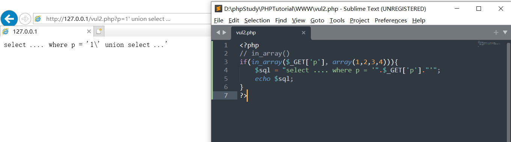
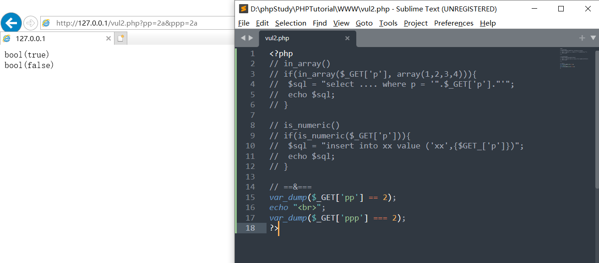

### 逻辑漏洞

#### 等于/存在判断绕过

##### in_array()

in_array() 函数搜索数组中是否存在指定的值


```php
// in_array() 
if(in_array($_GET['p'], array(1,2,3,4))){
	$sql = "select .... where p = '".$_GET['p']."'";
	echo $sql;
}
```


例如上面的代码，判断传入的参数p是否在1，2，3，4中，如果在的话就进行sql查询，但是，由于in_array() 在比较之前会自动做类型转换，那么，我们试着输入?p=1' union select ...看输出的sql语句是什么



我们输入的值不等于1，2，3，4的任何一个值，但是却进入了判断并且执行了


##### is_numeric()

is_numeric() 函数用于检测变量是否为数字或数字字符串


```php
// is_numeric()
if(is_numeric($_GET['p'])){
	$sql = "insert into xx value ('xx',{$GET_['p']})";
	echo $sql;
}
```


上面的代码功能为，判断传入的参数是否为数字或数字字符串，是则执行sql语句，不过该函数有一个问题，**当传入的参数为hex时通过并且返回true**，而MySQL是可以支持直接使用hex编码代替字符串明文的，所以这里存在二次注入和XSS等漏洞隐患，比如当我们提交XSS payload的hex编码"0x3c7363726970743e616c65727428787373293c2f7372636970743e"，也是可以通过校验并且存到数据库中的，如果应用程序有其他地方调用这个值，并且直接输出，则有可能触发这段代码，成功执行XSS语句


##### 双等于和三等于

双等于（==）在判断之前会先做变量类型转换，所以可能存在风险

```php
// ==&===
var_dump($_GET['pp'] == 2);
echo "<br>";
var_dump($_GET['ppp'] === 2);
```


上段代码的功能，分别使用双等于（==）和三等于（===）判断接收变量"2a"，双等于（==）判断时true，而三等于（===）判断是false




#### 越权漏洞

漏洞通常发生在cookie验证不严格、简单判断**用户提交的参数**导致的


#### 未exit或return引发的安全问题

合理利用exit()、die()、return来终止程序的运行


```php
if($_GET['p'] === "2"){
	echo "come"."<br>";
	exit();
}
echo "go";
```


当接收到的字符串为2时，我们需要终止程序运行，那么可以在判断中加入exit来终止程序的运行


#### 常见的支付漏洞

常见的漏洞类型

- 客户端可以修改商品单价、总价和购买数量，服务端未严格校验；
- 重复发包来利用时间差，以少量的钱多次购买；


### 防范

- 深入熟悉业务逻辑，只有深入熟悉业务逻辑，才能根据业务需要**编写满足需求而不画蛇添足的代码**
- 多熟悉函数的功能和差异

